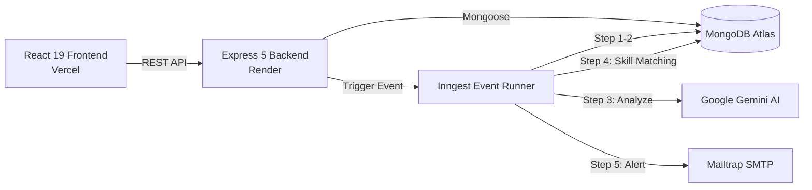

# 🎫 AI Ticket Assistant

[](https://react.dev/)
[](https://vite.dev/)
[](https://tailwindcss.com/)
[](https://daisyui.com/)
[](https://nodejs.org/)
[](https://expressjs.com/)
[](https://www.mongodb.com/)
[](https://www.inngest.com/)
[](https://deepmind.google/technologies/gemini/)

A full-stack, event-driven ticket management platform that uses **Google Gemini AI** to automatically categorize, prioritize, generate technical troubleshooting notes, and intelligently route support tickets to the best-qualified moderators based on skill matching.

---

## 🌐 Live Deployments

- **Frontend (Vercel)**: [https://ai-ticket-frontend-phi.vercel.app/](https://ai-ticket-frontend-phi.vercel.app/)
- **Backend API (Render)**: [https://ai-ticket-assistant-t6io.onrender.com/](https://ai-ticket-assistant-t6io.onrender.com/)
- **Event Orchestrator**: [Inngest Cloud](https://app.inngest.com/)

---

## 🚀 Key Features

- **🤖 Automated AI Ticket Triage**
  - Instant background analysis powered by Google Gemini.
  - Generates ticket **Priority** (`low`, `medium`, `high`).
  - Identifies **Related Skills** (e.g. `React`, `MongoDB`, `Docker`).
  - Writes comprehensive, technical **Helpful Notes** in Markdown with documentation links for fast resolution.
  - Multi-model fallback sequence (`gemini-3.1-flash-lite` ➔ `gemini-3.5-flash-lite` ➔ `gemini-3.6-flash`) for zero downtime.

- **🎯 Smart Skill-Based Routing**
  - Evaluates all available moderators and admins.
  - Automatically assigns the ticket to the engineer with the highest skill match score.
  - Fallback assignment if no exact skill match is found.

- **📧 Instant Email Notifications**
  - Welcome emails triggered on new user signups.
  - Real-time "Ticket Assigned" email alerts sent to the selected moderator via Nodemailer / SMTP.

- **🛡️ Role-Based Access Control (RBAC)**
  - **User**: Submit tickets, track resolution status, view assigned moderator and AI helpful notes.
  - **Moderator**: Manage and resolve assigned tickets matching their expertise.
  - **Admin**: Access the Admin Panel, create moderators, update roles/skills, and delete tickets/users.

- **⚡ Modern Responsive UI**
  - Built with React 19, Tailwind CSS v4, and DaisyUI v5.
  - Shared navigation layout with reactive session updates.
  - One-click **Demo Test Credentials** on the login screen.
  - Single-page application routing with Vercel rewrites.

---

## 🔑 One-Click Test Credentials

You can log in instantly on the [Login Page](https://ai-ticket-frontend-phi.vercel.app/login) using the one-click buttons:

| Role | Email | Password | Pre-Configured Skills |
| :--- | :--- | :--- | :--- |
| **Admin** | `admin@test.com` | `ADMIN@123` | `react, node, mongodb, express, system` |
| **Moderator** | `moderator@test.com` | `MOD@123` | `docker, devops, linux, cloud, backend` |
| **User** | `user@test.com` | `USER@123` | *(Customer account)* |

---

## 🏗️ Architecture Overview



---

## 🛠️ Tech Stack

| Layer | Technologies |
| :--- | :--- |
| **Frontend** | React 19, Vite 6, React Router v7, Tailwind CSS v4, DaisyUI v5, Lucide / Heroicons |
| **Backend** | Node.js 22, Express 5, Mongoose 8, JWT, bcrypt |
| **Database** | MongoDB Atlas |
| **Background Jobs** | Inngest Cloud & Inngest Express SDK |
| **AI Integration** | Google Gemini Generative Language API |
| **Email Delivery** | Nodemailer with Mailtrap |
| **Hosting** | Vercel (SPA) + Render (Web Service) |

---

## ⚙️ Local Development Setup

### Prerequisites
- Node.js (v18 or higher)
- MongoDB Atlas cluster or local MongoDB instance
- Google Gemini API Key
- Mailtrap account (for testing emails)
- Inngest CLI (optional for local event viewing)

### 1. Clone the Repository
```bash
git clone https://github.com/aadi02anu07/AI-TICKET-ASSISTANT.git
cd AI-TICKET-ASSISTANT
```

### 2. Backend Setup
```bash
cd ai-ticket-assistant
npm install
```

Create a `.env` file in `ai-ticket-assistant/`:
```env
PORT=3001
MONGO_URI=your_mongodb_connection_string
JWT_SECRET=your_jwt_secret
MAILTRAP_SMTP_HOST=sandbox.smtp.mailtrap.io
MAILTRAP_SMTP_PORT=2525
MAILTRAP_SMTP_USER=your_mailtrap_user
MAILTRAP_SMTP_PASS=your_mailtrap_pass
GEMINI_API_KEY=your_gemini_api_key
APP_URL=http://localhost:3001
```

Start the backend:
```bash
# Terminal 1 - Express API Server
npm run dev

# Terminal 2 - Inngest Local Dev Server (optional)
npm run inngest-dev
```

### 3. Frontend Setup
```bash
cd ../ai-ticket-frontend
npm install
```

Create a `.env` file in `ai-ticket-frontend/`:
```env
VITE_SERVER_URL=http://localhost:3001/api
```

Start the frontend:
```bash
npm run dev
```
Open [http://localhost:5173](http://localhost:5173) in your browser.

---

## 📝 API Endpoints

### Authentication
- `POST /api/auth/signup` - Register a new account
- `POST /api/auth/login` - Authenticate & obtain JWT
- `POST /api/auth/logout` - Invalidate session
- `GET /api/auth/users` - List all users *(Admin only)*
- `POST /api/auth/create-moderator` - Create moderator profile *(Admin only)*
- `POST /api/auth/update-user` - Update role & skills *(Admin only)*
- `DELETE /api/auth/users/:id` - Delete user *(Admin only)*

### Tickets
- `POST /api/tickets` - Create ticket & trigger Inngest AI triage
- `GET /api/tickets` - Fetch tickets *(Users see own tickets; Staff see all)*
- `GET /api/tickets/:id` - Fetch ticket details with AI helpful notes
- `PATCH /api/tickets/:id/resolve` - Mark ticket as resolved *(Creator / Staff)*
- `DELETE /api/tickets/:id` - Permanently delete ticket *(Admin only)*

### System & Background Workflows
- `GET /api/test` - Healthcheck endpoint
- `ALL /api/inngest` - Inngest event bus endpoint

---

## 📄 License

This project is licensed under the ISC License.
